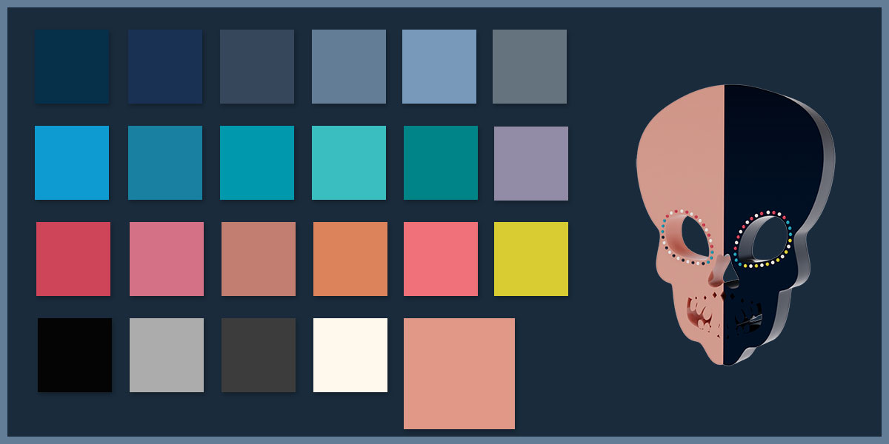
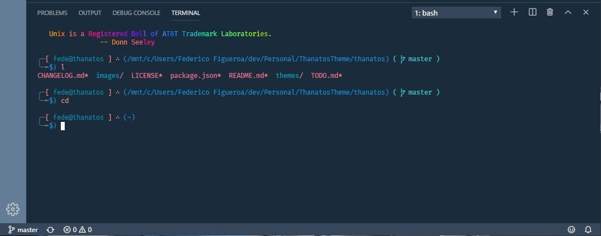

# Thanatos Color Theme

## A dark theme that's easy to read, good for long sessions.

Based and inspired on other color schemes and things I liked here and there, some care was given to readability of selected text.




If you want to have Bracket Pair Colorizer match the theme, here's some code to get you started
```
"bracket-pair-colorizer-2.colors": [
    "#0099ad",
    "#928ba6",
    "#d8cb32",
    "#008486"
  ],
  "bracket-pair-colorizer-2.unmatchedScopeColor": "#fef8ec"
```

You can find a PS1 setup for the terminal that uses this colors to it's best potential (imho) [here](https://gist.github.com/fedfigca/53f0e55b2f9ad6c73b036edb6ff6f010)



Please enjoy it, modify it, critique it and share it.

Contributions, feedback, bug reports, requests, [here](https://github.com/fedfigca/thanatos).
